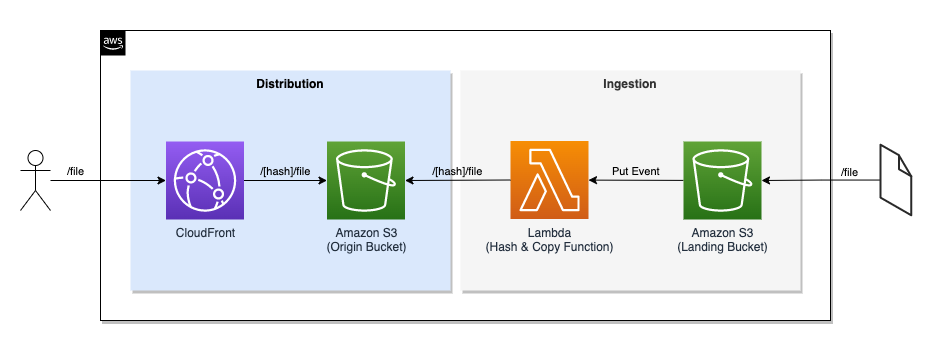

## Amazon S3 Hash Prefix
Amazon S3 Hash Prefix helps you scale out read and write operations limits by dynamically injecting an hash prefix for each file stored in S3.

As per described on [S3 Best practices design patterns](https://docs.aws.amazon.com/AmazonS3/latest/userguide/optimizing-performance.html) you can increase the read and write performance by using prefixes to create a parallelization factor. Those prefixes however must provide a high level of entropy in order to offer a large number of partitions as detailed in the blog post [Amazon S3 Performance Tips & Tricks + Seattle S3 Hiring Event](https://aws.amazon.com/blogs/aws/amazon-s3-performance-tips-tricks-seattle-hiring-event/).

Amazon S3 Hash Prefix creates high entropy prefix by hashing the object name and prepending that you the object key.

## Architecture Blueprint


## Requirements
- [AWS CLI](https://aws.amazon.com/cli/)
- [AWS SAM](https://aws.amazon.com/serverless/sam/)
- [GNU Make](https://www.gnu.org/software/make/)
- [npm](https://www.npmjs.com/)

## Install
```
make install
```

## Usage
`make dep` install Lambda dependencies

`make install` execute `dep` and deploy the solution

`make sample` create sample files containing datetime in a tmp directory

`make sync` synchronize sample files with landing bucket

`make clean-tmp` cleanup temp directory

`make clean-buckets` cleanup landing and origin buckets

`make clean` execute both `clean-tmp` and `clean-buckets`

`make uninstall` undeploy the solution

## Uninstall
To uninstall the solution you must clean the buckest and then delete stack using [CloudFormation](https://console.aws.amazon.com/cloudformation/) console or executing:
```
make clean-buckets
make uninstall
```

## License
This library is licensed under the MIT-0 License. See the LICENSE file.
